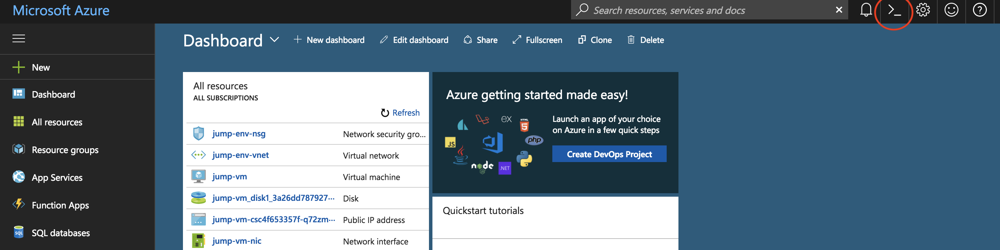

# Azure Kubernetes Service (AKS) Deployment

## Create AKS cluster

1. Login to Azure Portal at http://portal.azure.com. 
2. Open the Azure Cloud Shell

    

3. The first time Cloud Shell is started will require you to create a storage account. In our lab, you must click `Advanced` and enter an account name and share.

4. Once your cloud shell is started, clone the workshop repo into the cloud shell environment
    ```
    git clone https://github.com/swgriffith/blackbelt-aks-hackfest.git
    ```

5. In the cloud shell, you are automatically logged into your Azure subscription. ```az login``` is not required.
    
6. Verify your subscription is correctly selected as the default
    ```
    az account list -o table
    ```

7. Find your RG name

    ```
    az group list
    ```
    
    ```

    [
    {
        "id": "/subscriptions/b23accae-e655-44e6-a08d-85fb5f1bb854/resourceGroups/ODL-aks-v2-gbb-8386",
        "location": "centralus",
        "managedBy": null,
        "name": "ODL-aks-v2-gbb-8386",
        "properties": {
        "provisioningState": "Succeeded"
        },
        "tags": {
        "AttendeeId": "8391",
        "LaunchId": "486",
        "LaunchType": "ODL",
        "TemplateId": "1153"
        }
    }
    ]

    # copy the name from the results above and set to a variable 
    
    RG=

    # We need to use a different cluster name, as sometimes the name in the group list has an underscore, and only dashes are permitted
    
    CLUSTER_NAME=[Enter a Unique Name]

    # set the location to one of the provided AKS locations (eg - centralus, eastus)
    LOC=[Enter an Azure location]
    
    ```

8. Create your AKS cluster in the resource group created above with 2 nodes, targeting the latest Kubernetes version with rbac disabled
    ```
    # This command can take 5-25 minutes to run as it is creating the AKS cluster. Please be PATIENT...
        
    az aks create -n $CLUSTER_NAME -g $RG -c 2 -k 1.9.9 --generate-ssh-keys -l $LOC --disable-rbac
    ```
    > Note: If you get the following error you will need to manually pass in the service principal and client secret as seen below.
    >
    > **Error:** *Directory permission is needed for the current user to register the application*
    >
    >az aks create -n $CLUSTER_NAME -g $RG -c 2 -k 1.9.9 --generate-ssh-keys -l $LOC --service-principal [insert service principal id] --client-secret [insert client secret]


9. Verify your cluster status. The `ProvisioningState` should be `Succeeded`
    ```
    az aks list -o table

    Name                 Location    ResourceGroup         KubernetesVersion    ProvisioningState    Fqdn
    -------------------  ----------  --------------------  -------------------  -------------------  -------------------------------------------------------------------
    ODLaks-v2-gbb-16502  centralus   ODL_aks-v2-gbb-16502  1.9.9                Succeeded             odlaks-v2--odlaks-v2-gbb-16-b23acc-17863579.hcp.centralus.azmk8s.io
    ```


10. Get the Kubernetes config files for your new AKS cluster
    ```
    az aks get-credentials -n $CLUSTER_NAME -g $RG
    ```

11. Verify you have API access to your new AKS cluster

    > Note: It can take 5 minutes for your nodes to appear and be in READY state. You can run `watch kubectl get nodes` to monitor status. 
    
    ```
    kubectl get nodes
    
    NAME                       STATUS    ROLES     AGE       VERSION
    aks-nodepool1-20004257-0   Ready     agent     4m        v1.9.9
    aks-nodepool1-20004257-1   Ready     agent     4m        v1.9.9
    ```
    
    To see more details about your cluster: 
    
    ```
    kubectl cluster-info
    
    Kubernetes master is running at https://odlaks-v2--odlaks-v2-gbb-11-b23acc-115da6a3.hcp.centralus.azmk8s.io:443
    Heapster is running at https://odlaks-v2--odlaks-v2-gbb-11-b23acc-115da6a3.hcp.centralus.azmk8s.io:443/api/v1/namespaces/kube-system/services/heapster/proxy
    KubeDNS is running at https://odlaks-v2--odlaks-v2-gbb-11-b23acc-115da6a3.hcp.centralus.azmk8s.io:443/api/v1/namespaces/kube-system/services/kube-dns:dns/proxy
    kubernetes-dashboard is running at https://odlaks-v2--odlaks-v2-gbb-11-b23acc-115da6a3.hcp.centralus.azmk8s.io:443/api/v1/namespaces/kube-system/services/kubernetes-dashboard/proxy

    To further debug and diagnose cluster problems, use 'kubectl cluster-info dump'.
    ```

You should now have a Kubernetes cluster running with 2 nodes. You do not see the master servers for the cluster because these are managed by Microsoft. The Control Plane services which manage the Kubernetes cluster such as scheduling, API access, configuration data store and object controllers are all provided as services to the nodes. 
